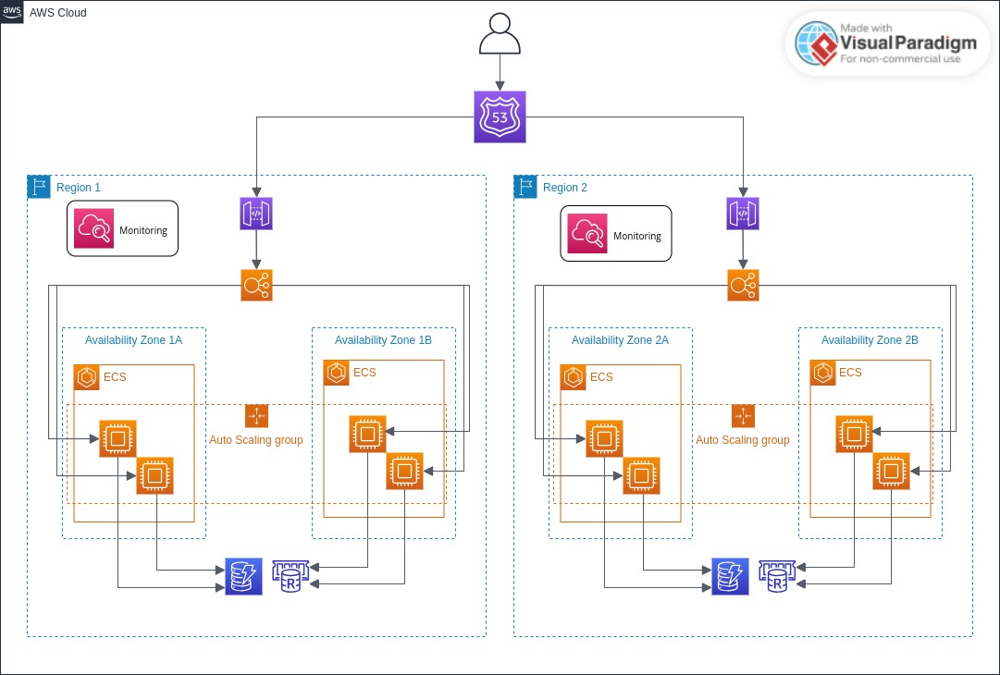

# Bank as a service para transferência entre contas

O presente projeto visa disponibilizar REST APIs para realizar transferências entre contas bancárias.

## Tecnologias

- Java 21
- Spring Boot
- Spring MVC
- Spring Data JPA
- Spring Data Redis
- Spring Validation
- Spring Kafka
- PostgreSQL
- Okhttp3
- Resilience4j
- Schema Registry
- Avro
- JUnit 5
- Lombok

## Setup

Para utilizar o projeto, realize os passos a seguir:

1. [Clone o repositório](https://github.com/mllcarvalho/DesafioItau) que mocka os serviços terceiros e siga as orientações presentes no README do projeto;
2. Clone o presente repositório seguindo os comandos:
```bash
  git clone https://github.com/angelicamarttins/baas-java.git

  cd baas-java
```
3. Certifique-se de que está configurado e em uso na sua máquina a versão 21 do Java e rode o projeto com os seguintes comandos:
```bash
  docker-compose up -d

  ./gradlew bootRun
```
4. Uma vez que a aplicação esteja rodando, requisite o endpoint `http://localhost:8080/transferencia` com o body:
```bash
  {
    "idCliente": "2ceb26e9-7b5c-417e-bf75-ffaa66e3a76f",
    "valor": 500.00,
    "conta": {
        "idOrigem": "d0d32142-74b7-4aca-9c68-838aeacef96b",
        "idDestino": "41313d7b-bd75-4c75-9dea-1f4be434007f"
    }
  }
```
5. Você receberá um retorno similar a esse:
```bash
    {
      "id_transferencia": "07b327f0-eea9-49ce-b693-12f096396cbe"
    }
```

## System design
[Link para visualizar melhor o desenho arquitetural](https://online.visual-paradigm.com/app/diagrams/?lightbox=1&highlight=0000ff&edit=https%3A%2F%2Fonline.visual-paradigm.com%2Fapp%2Fdiagrams%2F%23diagram%3Aproj%3D0%26id%3D1%26type%3DAWSDiagram%26width%3D11%26height%3D8.5%26unit%3Dinch&editBlankUrl=https%3A%2F%2Fonline.visual-paradigm.com%2Fapp%2Fdiagrams%2F%23diagram%3Aproj%3D0%26vpov%3D16.3%26vpob%3D20220410%26client%3D1%26edit%3D_blank&layers=1&nav=1&vpov=16.3&vpob=20220410#R3cU2FsdEGVkX1y9HJ%2BCK3nP5ACuDyn3UWTYL7jUKMWSlrIStxgroA%3Dl8XOTjL5GDNZteNrL1QcpAPgYyCiFwo3JET7cSCfqcV33XvKjqDZPXQuBTjgTS8XaHHedNpbS5riQuBy6Xv%2FVU1gQA%2Fj1k1a4uDaGB0z8fkGlhr1Aptmpa0ioQDampUs04241FVWlqPRATKeeZ%2F5vcjQZPaOYEJGWpsWksxpQRy77e8CkA6c8ndi9FWBozYJk3pC80BMYHwvCUxWQYEkVfnetzod5dxaz22w%2BgF12ktlexTE03PhX%2BfKu4amntD9OupJNvvhnoYe5C6eUmIdhZP8Hv94Vtz0R2v8nh18y2cPjgE%2F%2FaCzDfCvTM4%2FMaoJgHBqc5cdpbSYVA8foEMaEubhu62tXxcTqtNRKn9wpmlLsfcSJGUeI59jeFFYUXLDVSEQ0eUC7fd1Pjy%2BIYR0rhZdf%2FSvi4bAxXCKCctUBKyFGWDPlYxJKXoFUc4xynnARz%2BogYvOFYjpzH0lPA3kfMpFYGULyWVwoirh%2F9qUQyzPOWOdtx8GQojBkKQaFNdvVr53hTVmSmVs8CZWVfnY6a0YpuGjt1zOx2jAQawCwp0YDGlzF03q9eL7KmXtvPylt%2BWnVO7GrU4YAanJOXrBvfLqbtQsXRzGq3wv54iyjdxO1qkSKNwcFeffZhAQpyfk74xBzFbN%2Fqkqwgsqn5ZTS%2BLZGHejNaswzj2veW64DEkmgs78ouFLj1hx9MAL5C5OXbkxjpc2H2Z%2F6kk3HGa8sNTW%2BWWLfCviyBafzhSIjdDP8K4rXJssci5N%2BRq6hrQGCRB9vBCSqSUjmhKO1VstZ6SCV8vaQuFqFixtLbUnpPsHnKA7tz2G7vAPHckU72mFl2sMSA1kzzdjcW5yWiM0dYGkiyvT2B%2BEkDMf%2Fv6C%2BFHu5UG8EA5xt55zdhcZrEGpZcOFD02KXk%2BRfqkDfM3Rx0MJie3iTlA3EJVpM%2FsTUWhTtD35Q0wErwyfjITRTghFJtvcsGjuUbsXGQW6%2Bg1a9Jr3t3Cbwzp4RQ3nPJbJY%2FoVYnOuveWSolB1ZgbhOveFU%2FyLHNUcakuS7PtqYUD8D7tGETtWhKJFP31%2FF13EQ6L90wNlkzAsIORrXFn4p3K67%2B6q6CnnDO5oCheyz0T%2BOQN3GpaLe8KhwF3aCajUHK3FJ4XUiJjq4dejDFGSsRr7XjiU9yuDKuBy%2FFysSS1XRh4aNKzkYvYRk8GyvY2%2BO5dnA6FCqJdAkqD5hKZGUTP3sxhqaA2zrETFQxX1u2%2Ff2Z5vbKI%2B8ghp86DE9R71bNgZxdjxpwuJ1VhyLb7GawBDNGn5Fc6NEDC9v4nA8ahHg0k47000ifMy3Seq7ht3voBL1x%2Bs8IOIale9rbS7Klltmpz7KEbPR8JYR8bwF4FwGMOhWw1JUkXxWghuf2UcIZJZc1aWAW7Vhgimb2iRXXsVdrnQyXSLBP4lRgzde3MqR2wITWFxJo0tNxVR0dAwycnAGr53YR7VP0Ca%2BMgAONB78XcyZwcE2vXbrsWeqD01P9SFuu0m7W9DX9pxU4hO0kN2bF2Nm3MnQKy5g%2FmQ2xIHWgFgo65%2F3Wq6rGS%2BEu4olKXQ751s4eE6ocU0Bz%2BJkiQfd2W0iBYSD06ItueicoHmZGmg4SiwClFwrPiAS9czouzmZqyhAQpT4OeCSFZFuiNb4LWk7dASWo2KchlnvJpXkBVs6rFXtFrboE1tqzpjqjy3tJRILyQX8Rt3dE15tEm9NxtVTZhvHk9fs9P99MlNYTMppbE5fTPHbX8%2FfeEbYMMnwM0gc4eyeUUka%2BfeGf34WNfre1h1z6C8Y25BQBnMHmRQCCw32JqN1eAsJRgbIRpVa%2BGibbWCNYecA8pjQ38KUO11tDpQA7Bn1eqsDQpYOC2WaCBK7rLIPTwkMloQOfqtp%2Bzjg6Jj2z273UdetLJR4tXA2m5w9x3xX6xULNTkGUWne0a2aDicBPk%2Fb5g89jhV%2Bz6bQO8pNEDBRhvD2tDkncUBNEbUMGhhRM2tiSOtGMrGJyMqUaEqDzW7PzY%2FGRoMjT%2FbR1WC9O0%2FM2pTOpMrsQRhrnuyP5f8k0AzsF%2FeWzigjeaDIhIPBwrtNLcOQGNYCgq7ZL5g%2BdvRiNSKP6ZGCwwi7ZIitfxXOl4ZF%2FoaTrIV5ccjjLldXD08i2l%2Fz0aZGLxxyjpGA8GpaNH0Lv9RbdUIUaj06AFbIn3rj5WL1PUo5fWNZUPVKvfcxacz71rXXQDMWBUMHs49idgmWZpo50LSijwn0e%2BY9oiKor2nKDcTeFvmWsMJj1jmJbRrEHoSogRI6HNqRr4zofREwRk4UzVpSVPk2LADdHzQsciWiI0nY0sfX7Pxv04ESYLWHBrxsnyrr2F0ZNvaaHIu9TyBVTtdYK0VvgsXHp4rtYY30ky4hi9zjHJf2UaRLu8MwoUSSbOZE6UzPT%2F7KpgdB4UC%2BYtLNF9Wnac5cZFkV%2BpgOg30ZSIHvuXLUyVJibSwdGSYE5hNI%2BL6CMWyWqJ4XTZ%2FNGk6mE2r60tmX4arxDT0F%2FfO5510vX9rC%2FUkBq%2BF2FQwFh1uWuOOcteo1W9awSwAxpnNz6utaJfa4JP%2Bp1zq1b8uzrpM60XV8icMM%2FijGjma1Uhjssz3GWo3FecziO5Fq8F69O1DcdFtMfeG1ezVgQ6hZPjE262EQHUHkl%2BYOdVLqZlMDCKdjU989%2BqloNc%2BjWyu5VyyN8pDpfQNGockzRO2k7d6tpoxB6hIGrdeTkZPJCcU7q09ddJZPYS1v9Of3OdfZhW23AIjoTUkqbjq5GZsSfvXPyXMdeoel7RlC4YneCYa%2BSHj%2FCKyYDyXEjy52RLAia2gjGlGAJSYtyt1F7l0XsiWVSOigIkwT4mpy2mIbOyABksYHBE%2FD%2FFcL4ETBWE2sW7Frp5zqusD4ydF%2FcsRELVJ0tuSK%2BGyVQyTF5v4REEVWHdHACEb97hSVol83eDAqWlx%2Bl5xQccuxloeBLBpMbtNWliDzpqPuTwku4f41PWiBXBhVA2iRwop8I0D1gQaDiff9W%2BYiv51dL3jizjQZvKnvaXVShi4mWc4g%2BSF5FxZFR%2Bja%2BpJvvyG6bA0agMGZUUdE07lIsqVs9CZfX86pb%2FM85B1zUJX17qHmLd%2Fbx2Fr3Q3ZEADktgE9ltxo85wzvxmDeN52qsaeugdHTZrad514n3dz68vr6no1RFW%2BSqdxJNkJli7fxJlu1clsgIVso5D7%2Fhtg5AmPhFSZGZxs6Dj9s5cbWwrlkQVls4t10g%2FboUaKIFIzghsw%2FfOZExBKayJCTtSARgL%2F4ylK3Sh%2Blnqty5mqH5RBGlszh0lQK%2BZq9sSo9%2FBfbergOm9hr6mlmhEEx0tZoxlBn%2BdBor%2BaUHIotfiBfjluRzpFUTawom0SamUUNSY2e%2B5ATlX8uH1t9S%2F7WZ63gLSZXdbG1Z7Ili3dOJNBwvx%2BwuIi4PcbbNYnSNRdSiN4EQ%2FrXf4oe3JsEk7NY9nfl9%2BgCOZWKaGnUbsS7DvlSOp%2BxyYMZJNi%2BoM1Cq5zUn69EOZF7XdA2AeEE4UIQTBU897dBdMYqbEa17E1vGfJPlAaeqHq060Qk35iOGDAnAzkTJlohtaZjm6yOwsPLqNHiK2i62rcbrj1zaVF%2F%2BBxz%2F%2BrFXUP3Bg8friThb8IuKgjS%2F42DmSBr2MR4TvwtE1V%2FV2HXDbHvRcpHSIWTBXSWolfmX7DbNEu59htHykeYNMqOQ5GwBo0EuqMIR57tOWCImbMP8lvdOBIP1BSFFo1vv4pkRHf8uAMf2rj9pzI%2BTJkuxIP7j%2Bjze%2FlZJr14FsxQm%2FV5agRvzvwwm5F0FMSzzFmUxkZoJRX1Q8Xf2DotUEMOsbAVUhKoXXDfuNjq5rUS%2Fx05rMGEZDboJTwKFUPwk4y%2FVqZBIUWEVe2xf3B00JIx2S%2BoBz%2FXlpXec0orXWq1tYIUA%2FqeEFvnW8mcpjj8e%2BqHO%2BM4jN4U6yr6tugaHLfW94zPjNt7Y74%2B9rRe9bd6xkpLoq2UPUGGZ9C4b4soaszhqTKuIkAbfpDKNPFcgsvJKezuFsLP%2ByCS1O9GHCPjOvoN30aRaO5E1knIoLBYR8isswp2qWqpsVapbM6DGAhGnmNKOCthmpBbn2JSJSb4WaPXqwVxfUciQixy%2FkzYqzl4AaIEOZFGfMsmbyVYfVMAexVnNtD15thETk5mjHMHRDw2qo8ASoY84UUZu%2BsZ7Hwqd5wnNXy%2BcfgGYYe0p4OiY%2B4HHSBlFAqAT%2BTkkxKMYahBOvI8UrbckObldN0TWnPB%2F1FSecAjF1tKz1SvdqyLAlnF5ReHAtJVba0MSLoM7OOLl9AGVTNGqfvhPHHIps5LzJT8FLr3NVtpS6GbBpXu8%2Ff3PL7MwsnQ%2FA%2BBQmGOkGQGnb1gAon9BbXmTBC3bPXeDL02gOV7HVxdgfe4ZIwbFbOFt%2Bhs18gF8KM1PZ%2FTQ%2F%2B9%2F%2FOHbU8cvn2ux6gVQYVlZw0h3kshc7dmRqy%2BGSru8nR5HZFM5rRO0mOlIgrVmgpDTIZWdAC5rAPRzMK%2F05DQAKwIWCLdFS6oAb%2FbUxmg88Kmy94bWQEcCPzpsI%2FA8wnL4K6aSaqXw%2Bu2hRVhKswLbI3Unumr04VwuOffwD2shk1Zvjr21qUvEOFRAFotdfw409VVDfwjbUEyCMoApNmesE6YBzvmsMkr85Vf%2BKSANrRlNBa7z2dgOp0%2FOVP%2BtRjW1YS5GEEHqp8n%2Fh22wa3KQhF%2BVyUKmwcvEPiq4yjy19ls53f2jKkUYMC5JixvaGMbO4pE59pAiAz7l084nHofTZW1vaGt6QDvZ8huvjz1XmMKTkZsAYmRqv0S%2B8ZmlNid%2FpHw56q%2BbDsLGciRJH6kFzGKF4vUubG7ce3S%2FDgd2XCXO9G0oUYMBWRp5%2FoBb%2Bw%2BqG94TT%2Fie%2FR9vlim7BS4qBqht%2BGl1iWywbzVI9JNLMxDfXHHT%2BqNriXbTQLKVWYl75PGPipuydp2xU4NO4IB9InFZreVmih%2F1lg64tHeJ6CvYNfsoyfSk2qNORFiOn3y6SpgE%2FXNWm1kN5PJDHRJCWN%2FqBo%2BYAR9059mzUVOuhZmG1k%2BgurOrB3Qh2LoDJr8y8qFMUIANC1Q%2FDfxetAqtii4HGpDRZ6QlxWnSEc7dce%2F%2FaGsvfHcaJ7jC0tKQVUFpQdYu5oWnQ4L9qohhOyP%2FtGZ3E2o8A62Mj0Hpgq0fw0fQM10btZtMHpJnXnY9mbPeQIeqMCANJBwPTaoM9wS8jOV%2BGhU6e96h7%2BUTCdDJ6cJqyw9w%2FMXdZDlUDEuOk%2BHXRSGNk4AUDTt1ZrpDjspxUzS4MfXD159kOl6E%2FPXZAPJlbmFlLYOYAvKVq8sDjnh2dgxG9fcfk9BkgpGkLc1dsshwKK%2BIMEEDQ%2B4QpfHDgSDXaujGn9it38xr9SolalTFYJq8RwseeIUMm%2BDdj00oFoWLUu7RWXGTkWVwiOq1eM3%2FvAuvgTFxjsilVa48wnp0vyqF8Y4JKnA%2FtYNqL4dNxvnUtZt6vdmKsMVkf6SinglqCaWL75dtY0j22xrpXheeJIHL%2FgKIgEMGIkFAGzYWqfMAT9btP9YKXdrPyghiF%2BlNJ8OEhCk3no253MJnH8Xo9RtUZ4yxmoAW2jhQVrX5KzjVRtRVE2l8ZkblJ10Ia%2Fl5Vx0RU6SMgH0V86D656zOCStz37OXse4VLnOrOoPhkFX%2F1%2BzpCirjwrqLAoE27UNLNlZYxRVYoUvVB6aZJB3KbJLXJzfg%2FzHFbWZ3mDigdtfZSYenNUzW%2FdekLm2lVUqSUmw%2FVAffwA13sE91iCgJGyKBt1gvRjagvLiT0xzO8i90WjQZpn0swG%2BDoJnC%2Bht3wUbXtwqHtVNGJv1F3PJZVRlmQZtt3Zjpam6jPW82yIAmexV1zEnem3FjBKk444SZ1Z5VFjxVV%2ByTK%2FFoRmGqe8cCrkFqHd1%2Bzx3VINNGdk9UwKrvfbEu%2BCj1OFHl1gEWund0wQQOlezimn9LUEEHxpI20Q6HUA8AnI3xX1yTuvpephtntWk20x87Asm1Hf9wxv5uoyDa%2BxpgC%2Br6gZTBa%2FUTJwsobzHv5Xnpp9YPJ1dURLQzUsvtiEQ%2FaRgL6D4DaIxptB7lNrM7Q%2FUv4IEswglLGLmgNdG7Xw6Q%2BQ%2B%2BhtkI3m0TTF2Ul5tSSo%2Fagv7d%2B1VDzkiMtCxq8Vi4KCMPbAvE6r2AAj8xxE6zExjxTjVf0f8pBHuXKqusPMv4drZzzrGuLq62LXUAj8JxFFECq2F%2F7PJFevw0BqUVpbVEG2bJxhS3rDXl6sGF%2FunYS7LPx%2BzBc9qXFS4dlq8KmDDQlB0BEmBy%2BZLHMpV47EELTmZG7%2FhGCKF2HW6gX%2FDAvqpBrSI0brzwlZmbOOBKTSEgQI2ZNYTehi%2F8DyYE4rmL13r1F%2Fd01jhjXAftC2GwUt882plCaQRSU%2BmW3vD9HIiWg8SKQt4EqdzivXhvlz%2FTugVjoqwxogrVQeZQ9Ibp0YcfVV4ZOpx%2Bhd6n%2F2JtVw0hl7791KoVdy6pdMF5bT%2BK48TxdfL90nQaVt9ihRdnKQwwz%2FXKgLWy0swd%2BirxI4DnB4r2ilZg12PwP5OyGXM37X3Yei8HKZKvUebaSBPfQ14b0lNY5CJzFe8%2FIGqi1BAgUxOQmX4%2Bih8SWHv9pzpYd2jLOq%2F5xY3EU7Af152D0s7v7%2Bo0YersVcM%2F%2F%2BZ4lb2RHrROInyp43vATdcy08Mb4AL2RPi4ixgKgKBYnXnSI%2BKsKW1sDjon7Mn8zE5TwAZRmsutg3k1hCeKI7kjDBSWn9joVV%2FONewYT6iclYi8r6lZiMry6JaH2Z1qef7cl415d%2BSvsCYT5pfv%2FEfny0Udojt4MjZtCyUD28awsOxZkg60Nr5lDkoooIDOQ%2Bx4wEmB7MAxrYn6BYXfI04Y9FktuSxZBUY6Ps5U3eBY%2FuVvdPTWU3smqsW62jmWO1nO9D3AzniXm%2FpkL24SAF%2BotnV%2BdAmtmrDz5aa%2BjGgLyQUCzRR%2BdyvJS9fGJYQAwt0ShGpKS1Lp98q0gm0e8kEJHHDux9vfVB8KwdtXKoKtWgJx1KZ5%2FF3I7lV2XCUMGrf9fO19%2BWfg8trNZElTVspTWomAQ43DksktZCA16TUq3sfqPRZh9d8PPaoT%2BMvMADMBA3gTZXWN2TSLSVUAnbiWGqAAwx6ksCkdUNhSJWtx9cftm80z%2FioikOgAKVGZMENk5QimvQ6gzi1xdad61tq4ggphgslbZjc0Tf%2F%2B%2FRU0EtiwhLyo%2BSLbHmWud0qlySZcdKpBqzBWCezNnzXV4Ej2xH7w8fMPdo2n9c9%2BvhEQAraaMkKNJPc1c5Z9pAShEjq47ZS4ow%2B8vzJEkYKSyf1jYRZ32OHL%2B706TATDGyE0iNYan6egUItAIUVaHCgjhV0xnbUF9fO6yfe2n6%2FKLFHYTbocXdzOxFruNDx29uYuSuArWGuQNqCZjySaJFrCx3UsE0KT1GNc1u8n1j64BFQ7aq23Acp8EfgS7GP4jAl0QIuyZ7Ha4TEtAoVZ%2F7dAdWj8zgy9EsUDbFdH9uErS7aWGvNoVsK2ynqldfyGkqKcn8wJyTb74GATVQ6lI8aNV05O4oKj8eEFYHWb2MveNm%2BGYPswAVxnhGylUoHL5024axjHam4VQ25qymVMdSsETGc%2FCaG3hoEo5iWwVHKrlCu5k9nJ4ZHG%2BlZ0UNwlN2gVf0HGt%2BGrfFpYW0sTn9pF032yrXCHXJlYqgnzkCvx1GxLk1zMR9YhTrYW%2Bo%2BoRRJPrIoZG83aacXvAGyS1ObZYOZ1PTUqDlnsRJjQw2xTL6prrh8JK%2Fv53An6t%2BQxp4xQTEyoW%2FMxcXhtO1RiVfoc7gqS7sigDZQCyKEIGLQcLFd7HvfnnBQ8as9BqnIugXEVLC6E8yKD2GlrzjF4CwbmKIC%2F07wBb%2B7Ip%2F3q7NOhnVPlc6%2Biu%2BWh2lc%2BSMvtI6RNV%2B2Qu57ecY4QI884fgvnuwBvGRBlXlgU6ATPsOe2iHWZqBD%2FNeT4xb%2B9ky5r7fYuXlSU5O653kMC06A55rILqnTbsAKdj9JxNYHl2fkonSs1Gk1DAVXmI1ARAc%2BB1aHCXrJAE5H%2Fwo1kTIbgCexKkMBNmPhbKACirIa9z%2FGWRdagAINHSRYFkueTdrcUYagt0VtyPzvxv2Wpnzh3t9sjsB1mjU6LLZQLH%2FA%2FlBscduJR%2Fcd2UALIi1WtKQ4R%2BccVGSG%2Bso8GZg462wbqfTrm%2BT8F4gTnr2JWe8c2ENUQoWnhMIsdjt8iwuLB5N3iNsV3iAjfp7MoAxI8D3P8aRjq0S%2Fu8f8360rq9SfBMVIzusZQ38gK4Vc21P98Z6kGViIW8gzMzfwlCsXNQoo1%2BrTV8%2FxDAgqAVSCh1YGovBpqWrlZNuNNiF%2BNzWGbj2BPWo%2Fv5fjuAH4YgkHXuGCCCGrxmCaRt1Be%2BSaFJJpQlLPC%2BL%2FcLVe0Kc8Eas8F90vu0E5q5RuIpI1C31FD5T02vw1EhNCSQ5wUX6DLVxVLs9d4KqmM7p0cAYcsK9PCXHGycaV0EYEkO79jVUqu%2Bm82MYs0B7d6Lwrn4jU27QnZpefbcyGIlF%2BrfyWM28S33Y%2FUf9yFUSKELueclX0gVFOE%2FXa06A53kwJ9AGqDzQfgrGylTMOtAN2Jc%2F%2FePbo%2F5oqRm0c3ZWQMn2yRwunx%2BxpfBPLArFfNVTJngIMdtPdPzBacpTgX68I2MpNHEAcJkUz1dEHlc5Tb3hE9f0PilwzsdBvxGi4WQX7zNoibTDpp1rzKicuZ9Ki%2Bmfkc8ejIEEs7TqgoA%2BMYBsgs8SSF4XKXsStkTxlFnxpJBvlrKTV9mYJDpChRealdavIYjHnK0k0ukRdl5BIL5GNEbh9KWXLrKGCT7mzx51CKwbGoEopKdkRX0VfW12nY7HpYd5oo4dr%2FZhHWSwFvFfIX8V59Usc13yb6EN6XXgT9UP9svz8j8iFfOZEJh6OfFwUBX0OAQYt0FzpbsAg2MugzOndMowcaoRyRQtatsIMMOSKbxjZQQC4EXdhBY%2Fy2J5yCtyUgS1QP3fCQV7A8J1ubX7sJTxNEItaRiXpeer479g8U2xHEwa1e8G4MOtfabzjMCWa6FvNFfpDUTHB%2FIEF66pre%2BoVioJvu6V%2B9K9YBCMJ9YHl5ikDhTDZDfopfHxAgpsOFSlidGn%2FPAI9QtvifTWam3rqbjxWG%2B4LjXd7D6ngOEU8o840zulr52fbigmP1zWlzx7H4AZjaKCsq2yXpFUnIBWikT%2BHnt8Kt1SKbNt3kntmWh4K211JW78ybeezY9dSoA6dF%2F0JT1%2B3d8T0lMbQcpQPXw8U%2FlyBDm%2FJlJNPx3HLCaspPo2d%2B5CeVR%2B8K%2FOyyDt%2BQL4kmbyBfLbVsPD8GEM26BHIpPhLP7jH5emDN4jMIrDRU3W5cdQqruk9A%2FLoJWjKzgpzyqB68toU4MMIrKAe2DgjTnV75Rmm9M1ztJFqb%2FeU%2BYYgEKDGoLQUWJNK1KjDdM7LAYPmSHfR%2FbRM57seIgSoBFT2cYDdnnB3OxpKFaq8Kt5%2FY6WNDIWibnPVVjAv7XC0ThvLDPZGfe4HRSNuVPLCqEk54mp%2F5JZZBx957FH1i%2FKQo8zkYo%2B0T%2FEVEahCNojpwtt3BTIM4GYgV1oG6GIL66a4TA6NN%2B%2B0JttAjY6GbDVg1jvIX9jOzyXduZiCPT9s68d9TgyOXY7CDkai9c6XS97MjzvLnESbGscR8LUXmtbc1%2F8O4fBXMFzyrB1kiguos1IdhejkvuQxS3jtWR8NulFTQOLaTm1A9L66bWKrEhK8V567HIVqJLBTZ73GcVyU0mB%2F1z5o40eHAlkSRf1NiNPO1Yv1GMezhL%2F4Li3gveYKTLtDG36itgK7PK%2FLZNs1Gcr1krO4PiOfEQJG4qOQMgvhunghBjxuA0qIsdbbJqj35Wzpc%2FcqQrmzEWyBiyuv4XNryD3nUADC6Wlnu9eW33jeA3x9miHLTOjTN7AZwCZxjexlMeZ7LzgGNeizzQvc%2BrQl4YyXRsVqkz6vq%2BajwBSYQK%2BScfMhqB3NYPj4XheADuCQUL7GOxWX8NuUcj9ODvZCN8LUTJxQy5nF8lm3Kk9Sbmyvvqf54W46%2BxFeHI2hq3d7e8w%2FHThW5jkoVnXlJQrgQaGgxeuXGvBNbv8pVAOP2Xc2Ce2HV%2B%2F2BriRmNsaQoFiUwWnPnORmu1FVhxSt4ChAIjjyNbFEf0Qt57t55kNKT2bzOZGznIVMyj87DIfuRg68Mq7fOlle7TcKevyM4fMib7FRmNfCs1Aj%2FfZjLb9s9uHeHOAZV5M3Td9s3F%2Fz%2BtkIydbrhWQLqMeUTuUeA3VHeJ9ZcNBseoprf5BbfO1QytRpAXd8zQSvohmmBTFqRk%2FDY%2B2EBcNUutnmBCRW4HcwY88QqnKv3haWVLayrneVeS%2FIWH9FHUejztX2P%2FtHgsZFl2PlziVgjlawtkPo3CAAvIf9DeSxdLDdbAhd0uXuGxX8TyWrm%2BB9qLIWWuqjosHasVjkUIV9bqGjuK%2B5hQBuP6PL2K2pM00%2Fr%2FhkVTGopyz14BorzCQFoi7p%2Ff%2B%2BOjvtbAowTyb80MRbuaFwXX0J6IOVyyiGCyRWaNR3guDUpSeKRFGjGp8JuxUmt313B8uU93aYlofcRPhDlg9hsiQd4BWyVszCBPo%2Frf3hz%2BhWIygpsTzFw3rFS7rU%2BKo4GzxJ5XrXLxAYoin0mkDv%2BSaxNlHBLoXjAGcOUEqabjnswoeO6ppr9qYwg8rYVIHN1FGJpya3RZe3lDt2fmgbxmI1pJ7%2FuSXox5p8q1Htiq6lAFJ%2Fj0Hj%2BiwRbhMbG8V9Aq9l51MCBvsHyh9IMCzJDE0f255aYfwzQ7hR47gT9aX0jietp7AoQpyIPNk%2FOnOG%2FNUWcS170eGW1NUYpiXMc3D13GVuPtrNLuHLG6lgTl3CL3fVqinibM4VFjx7nP8EbNI4srmIOZ6ZbzFTgm%2F9mX0v%2Br2jLyIono2tVKhmuSxUcJJ3w91HyPu9mz61JD8esYNCR9FH1%2BsCXOSZ3fw85ieONh4SCroU6bCEzcBy%2FWJN5KleCI6oMTfL7WrAdggl7DduX2oNXWvZ5ArXh%2FvSq2EoVYskYvOko0M4Iq5cu21q4kL%2FQjL006PSwl06H7GOiN2%2FNu5kEUWiynJiWeS%2FbZtgqZthGJNdtsbwMPn8NGn1JqnHmlMTuyCmq8qnpO9mTBc0qywSVAeNfsJIZIx2B9YoDWHO7CmAfHMclyQPhTGYZDOm7RRcyYObuwEqu9L0zPKOokeXOBMQ%2F3ipbFmjhxXKUO8HnUdIsodCwleemUHZslc2nNmE8y4%2FhNm61u8G3MM%3D1fjnt16a)



## Principais decisões
### Design Patterns
#### Strategy
Utilizei o padrão Strategy em razão das diferentes necessidades de transferência entre contas de pessoas
física e jurídica.
Por exemplo, em uma transferência entre pessoas jurídicas, poderia ser preciso verificar se o cliente que está executando a transferência pertence ao Quadro Societário da empresa titular dessa conta. Esse tipo de validação e outros dados a serem processados não caberiam a uma conta de pessoa física e tornaria o código confuso e de difícil manutenibilidade.

#### Builder
Além do Strategy, usei o padrão Builder na entidade `Transfer` a fim de facilitar a instanciação desse objeto, sem precisar criar inúmeros construtores para atender cada caso de uso.

### Comunicação com serviços terceiros
Em razão dependermos de serviços externos, criei um client com Okhttp3 para realizar as requisições e um interceptador para transformar as exceções recebidas em exceções conhecidas do sistema.

Por disponibilidade de tempo, optei por mapear todas as exceções em uma exceção genérica chamada `ClientException`.
Apenas um caso foge a essa generalidade: exceções com status 429, pois as transformo
em `TooManyRequestClientException`. Fiz isso para demonstrar que o retry configurado com Resiliense4j não iria seguir
requisitando o serviço terceiro, comento sobre isso melhor abaixo.

### Bacen indisponível e retorno da requisição
A fim de garantir resiliência, optei por não retentar comunicação com o Bacen quando a exceção retornada fosse 429, dado que o rate limit desse serviço teria sido atingido.

Para cenários como esse ou quando todas as retentativas foram realizadas sem sucesso, retorno 200 para diminiuir a espera do client e publico o id dessa transferência em um tópico do Kafka que irá tentar uma nova comunicação com o Bacen. Essa estratégia só é possível porque já realizei a comunicação com serviço de saldo e obtive sucesso, ou seja, do nosso lado do banco, a transação foi realizada com sucesso e podemos comunicar com o Bacen posteriormente.

### Resiliência
Pensando em resiliência com os serviços terceiros, decidi adotar três estratégias: retry com backoff exponencial, timelimiter
para derrubar comunicações demoradas e circuit breaker para impedir que novas requisições sejam feitas e retentadas
em serviços que demonstraram estar fora do ar.
Tais estratégias nos permite ser resilientes a falhas das dependências ao passo que não nos deixa esperando tempo demais
por uma resposta.

### Cache
Adotei o uso de cache para acelerar determinadas consultas a dados que foram obtidos e, caso nossa aplicação caia
e o cliente realize uma transferência em sequência, a aplicação não demorará a responder, pois os dados sobre o cliente recebedor e a transferência criada - quando houver falha no Bacen - estarão disponíveis por 30 minutos no Redis.

### Testes
Normalmente, eu teria testado todas as classes existentes no projeto. Por disponibilidade de tempo, decidi fazer
testes unitários nas principais classes do sistema: `TransferService` e `TransferNaturalPersonStrategy` a fim de garantir o principal fluxo.
